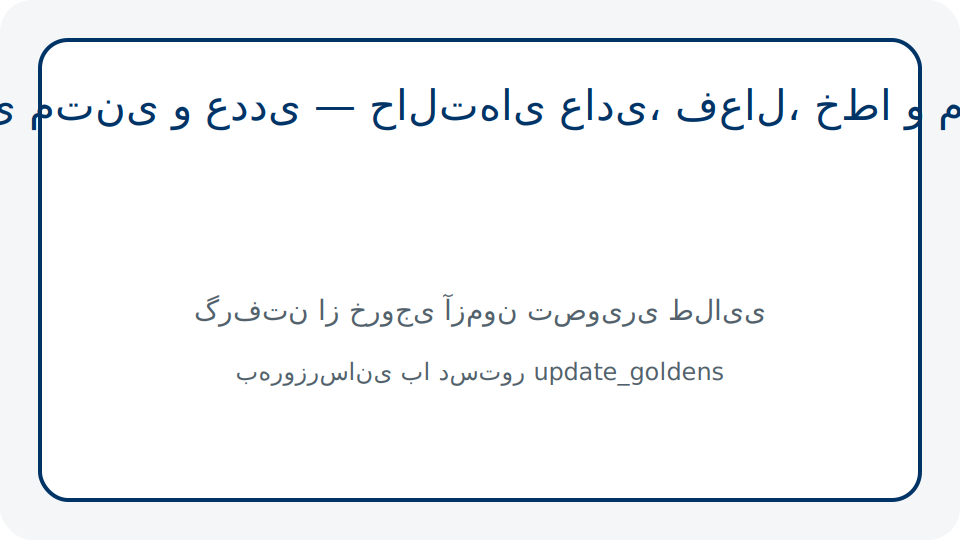
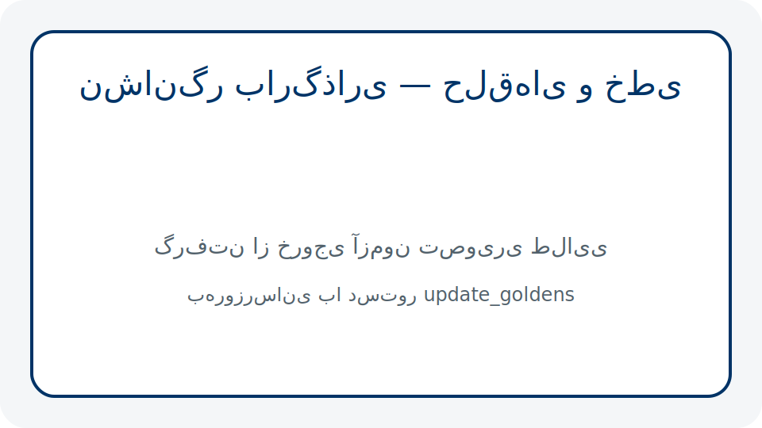
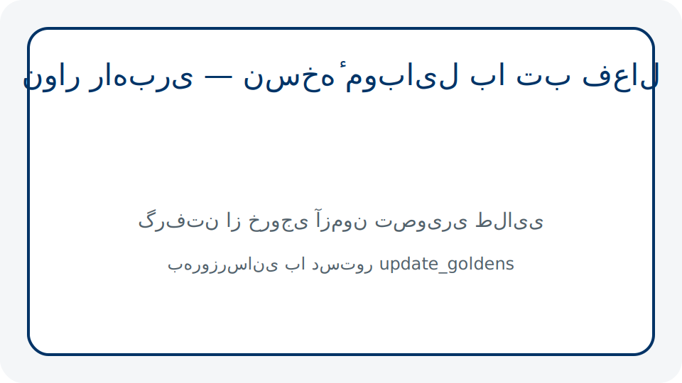
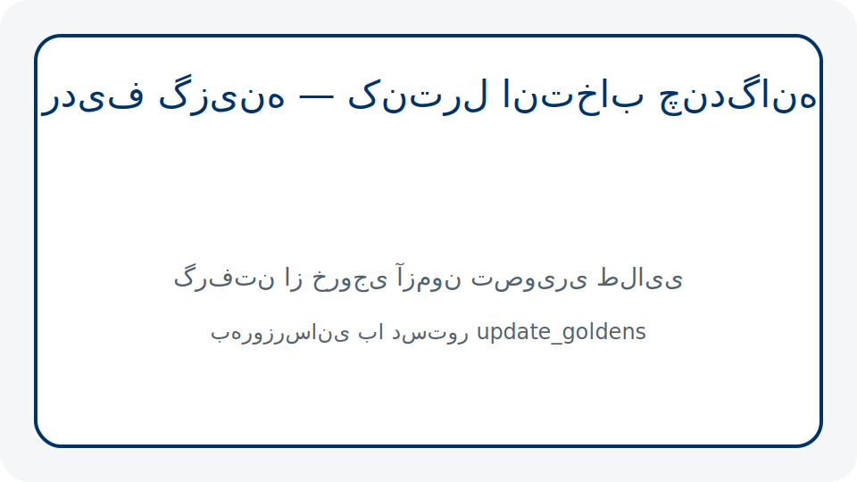
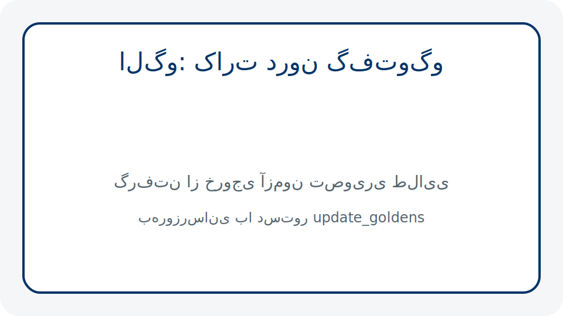
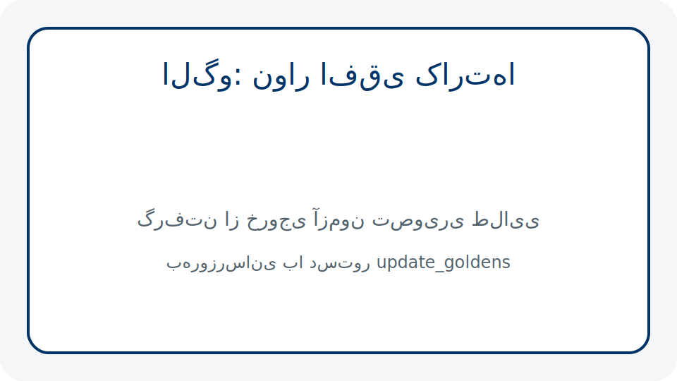

# سامانهٔ طراحی آپاتیه

این سند اصول، شیوهٔ نگارش، فرایندهای آزمون و چک‌فهرست پذیرش سامانهٔ طراحی آپاتیه را در اختیار تیم‌های طراحی، توسعه و تضمین کیفیت قرار می‌دهد. تمامی موارد مطابق سیاست‌های دسترس‌پذیری و بومی‌سازی تعریف‌شده در سامانه باید رعایت شود.

## اصول

1. **هماهنگی بصری در تمام سطوح**: رنگ، تایپوگرافی، فاصله‌گذاری و شعاع گوشه باید مطابق توکن‌های مرجع تعریف‌شده در سامانه و با تضمین نسبت کنتراست ۴٫۵ به ۱ برای متن‌های اصلی باشد.
2. **پاسخ‌گویی به حالت‌های وضعیت**: هر مولفه باید حالت‌های عادی، شناور، فشرده، غیرفعال، بارگذاری و پیام‌های خطا/هشدار/موفق را به‌طور کامل نمایش دهد.
3. **دسترس‌پذیری و بومی‌سازی پیش‌فرض**: پشتیبانی از راست‌به‌چپ، اعداد و تاریخ فارسی، خوانش‌گر صفحه و حداقل اندازهٔ لمس ۴۸ در ۴۸ پیکسل باید در طراحی اولیه لحاظ شود.
4. **انسجام گفتار و نوشتار**: کلیهٔ پیام‌ها با زبان فارسی رسمی، فعل و فاعل مشخص و پرهیز از واژگان محاوره‌ای ثبت شوند.
5. **قابلیت آزمون‌پذیری**: هر تغییر بصری یا رفتاری باید با آزمون‌های تصویری، رفتاری و کارایی قابل‌پیگیری باشد و نتایج در سامانهٔ CI ثبت شود.

## شیوه‌نامهٔ نوشتار

### قواعد واژه‌گزینی رسمی
- از معادل فارسی برای واژه‌های رایج استفاده کنید؛ «ورود» به‌جای «لاگین»، «بازنشانی» به‌جای «ریست».
- فعل‌ها را در زمان حال یا آیندهٔ ساده بنویسید و از افعال مجهول پرهیز کنید.
- برای برچسب دکمه‌ها از مصدر یا فعل امری کوتاه («ثبت»، «ارسال درخواست») بهره ببرید.
- واژگان تخصصی بدون معادل رسمی را در نخستین استفاده با معادل لاتین در پرانتز معرفی کنید.

### نگارش پیام‌های خطا
- ساختار ثابت: «عنوان خطا» (الزامی برای اعلان و گفت‌وگو) و «متن راه‌حل» شامل اقدام فوری کاربر.
- از لحن همدلانه و رسمی استفاده کنید: «در بارگذاری داده مشکل پیش آمد. دوباره تلاش کنید یا با پشتیبانی تماس بگیرید.»
- عدد، تاریخ و واحدها را به فارسی بنویسید. برای ارجاع به شناسه یا کد فنی از حروف بزرگ انگلیسی استفاده کنید تا دقت حفظ شود.
- پیام خطا باید اقدام پیشنهادی مشخص داشته باشد؛ عبارت‌های مبهم مانند «خطایی رخ داد» کافی نیست.

### راهنمای پیاده‌سازی اعداد و تاریخ فارسی
- در Flutter از `intl` برای قالب‌بندی استفاده کنید و الگوی Locale را `fa_IR` قرار دهید.
- با استفاده از `NumberFormat.decimalPattern('fa')`، تمام اعداد در UI به‌صورت فارسی نمایش داده می‌شود؛ برای ورودی کاربر نیز با `FilteringTextInputFormatter.digitsOnly` و تبدیل به `toPersianDigit()` در لایهٔ نمایش عمل کنید.
- تاریخ‌ها را با `DateFormat.yMMMMd('fa')` یا الگوهای سفارشی حروف فارسی نمایش دهید. برای ذخیره‌سازی همچنان از ISO8601 استفاده و در UI تبدیل کنید.
- هنگام تبدیل، منطق تست واحد اضافه کنید تا از بازگشت به ارقام لاتین جلوگیری شود. طلایی‌های مربوط به نمایش تاریخ/عدد باید در صورت تغییر منطق به‌روزرسانی شوند.

## نمونه‌کدهای کوتاه

```dart
import 'package:intl/intl.dart';
import 'package:flutter/material.dart';

Text buildPersianAmount(BuildContext context, num amount) {
  final formatter = NumberFormat.decimalPattern('fa');
  return Text(
    formatter.format(amount),
    style: Theme.of(context).textTheme.bodyLarge,
    textDirection: TextDirection.rtl,
  );
}
```

```dart
void showErrorSnackbar(
  BuildContext context, {
  required String message,
  required VoidCallback onRetry,
}) {
  ScaffoldMessenger.of(context).showSnackBar(
    SnackBar(
      content: Text('در پردازش درخواست خطایی رخ داد. $message'),
      behavior: SnackBarBehavior.floating,
      action: SnackBarAction(
        label: 'تلاش دوباره',
        onPressed: onRetry,
      ),
    ),
  );
}
```

## بهتر است / بهتر نیست

| بهتر است | بهتر نیست |
| --- | --- |
| برای حالت‌های مختلف مولفه‌ها از توکن‌های مرجع استفاده کنید تا تغییر ناگهانی در پالت رخ ندهد. | تغییر رنگ یا فاصله‌گذاری بدون به‌روزرسانی توکن‌ها و مستندات. |
| پیام‌های سیستم را با لحن رسمی و دستورالعمل اقدام کاربر بنویسید. | استفاده از لحن محاوره‌ای یا نبود راهکار مشخص در پیام خطا. |
| قبل از ادغام، آزمون‌های تصویری، رفتاری و کارایی را در محیط محلی اجرا و مستند کنید. | تکیه بر نتایج CI بدون اجرای محلی و بدون ثبت اسکرین‌شات/گزارش. |
| رفتارهای وابسته به زبان (اعداد، تاریخ، راست‌به‌چپ) را با تست واحد پوشش دهید. | فرض بر صحت تبدیل‌ها بدون تست خودکار و بازبینی تصویری. |
| در معرفی قابلیت جدید، ابتدا نمونهٔ طراحی را در سامانه ثبت و سپس توسعه را آغاز کنید. | توسعهٔ ویژگی بدون هماهنگی با طراحی و بدون مستندسازی اولیه. |

## مولفه‌ها با نمونه‌تصویر آزمون تصویری

- دکمه
  
- ورودی
  
- کارت
  
- برچسب
  
- اعلان
  
- نشانگر بارگذاری
  
- نوار راهبری
  
- فهرست
  
- ردیف گزینه
  
- کادر گفت‌وگو
  

## الگوهای نمایش با نمونه‌تصویر آزمون تصویری

- کارت درون گفت‌وگو
  
- نوار افقی کارت‌ها
  
- تمام‌صفحه
  
- پنجرهٔ شناور
  

## فرایند آزمون و پایش

### اجرای آزمون‌های تصویری (Golden Tests)
1. وابستگی‌ها را نصب کنید:
   ```bash
   cd frontend/flutter_app
   flutter pub get
   ```
2. آزمون‌ها را اجرا کنید:
   ```bash
   flutter test
   ```
3. برای به‌روزرسانی تصاویر مرجع پس از تغییرات عمدی:
   ```bash
   flutter test --update-goldens
   ```
4. تصاویر خروجی در `frontend/flutter_app/test/design_system/goldens/` ذخیره می‌شوند. قبل از تعهد، همهٔ تفاوت‌ها را بازبینی و در صورت نیاز از اسکریپت `frontend/update_pattern_goldens.sh` برای به‌روزرسانی گروهی استفاده کنید.

### آزمون‌های رفتاری
- آزمون‌های ویجت و منطق تعاملی در پوشهٔ `frontend/flutter_app/test/` قرار دارند. دستور پایه:
  ```bash
  cd frontend/flutter_app
  flutter test test/<path_to_behavior_test.dart>
  ```
- برای مسیرهای یکپارچه، از `integration_test/` استفاده کنید و مطمئن شوید سناریوهای ورودی فارسی و حالت‌های خطا پوشش داده می‌شود.

### پایش کارایی
1. اجرای سناریوهای کارایی:
   ```bash
   cd frontend/flutter_app
   flutter test integration_test/performance
   ```
2. اجرای ماشینی برای تولید گزارش JSON:
   ```bash
   flutter test integration_test/performance --machine > performance_log.json
   ```
3. تبدیل خروجی به گزارش خوانا:
   ```bash
   python scripts/parse_performance_metrics.py --input performance_log.json --markdown-output performance.md
   ```
4. در صورت به‌روزرسانی آستانه‌ها، مقدار جدید را در `integration_test/performance/performance_metrics_test.dart` ثبت و توضیح مستند بنویسید.

## چک‌فهرست پذیرش

پیش از تحویل هر تغییر، موارد زیر را بررسی و در گزارش PR ثبت کنید:

- [ ] تمام توکن‌های رنگ، تایپوگرافی، فاصله و شعاع با استاندارد سامانه همخوان است و نسبت‌های کنتراست رعایت شده است.
- [ ] برای هر مولفه و الگو، تمامی حالت‌ها در آزمون تصویری پوشش داده شده و تصاویر جدید در پوشهٔ goldens بازبینی شده‌اند.
- [ ] پیام‌های فارسی، شامل خطاها و اعلان‌ها، با شیوه‌نامهٔ نوشتار و قواعد واژه‌گزینی رسمی هم‌خوان هستند.
- [ ] تبدیل اعداد و تاریخ به فارسی در UI با تست خودکار و بازبینی دستی تأیید شده است.
- [ ] آزمون‌های رفتاری و کارایی با موفقیت در محیط محلی اجرا شده و نتایج در CI سبز است.
- [ ] مستند حاضر در صورت نیاز به‌روزرسانی شده و تصاویر جدید ضمیمه شده‌اند.

